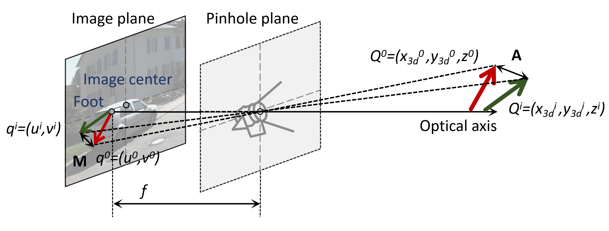
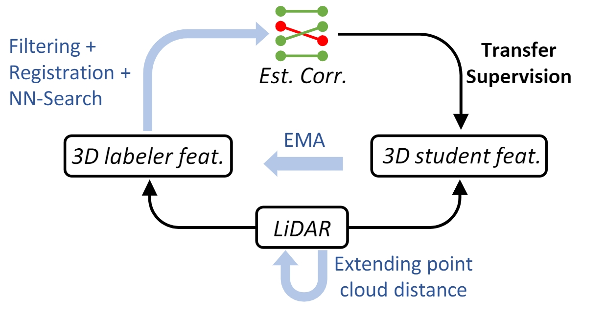
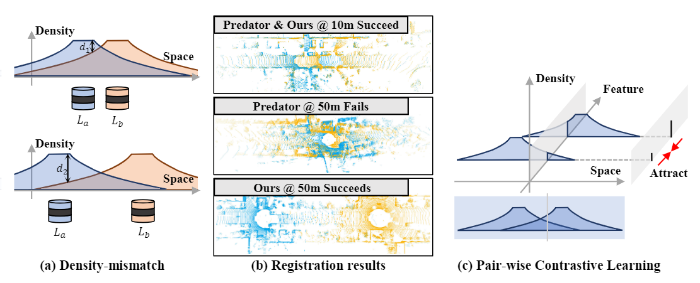
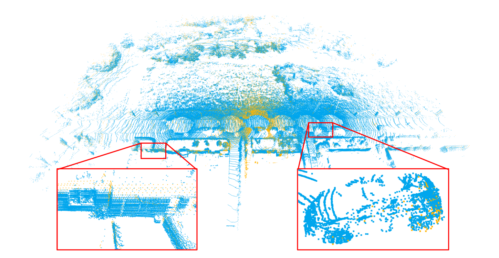
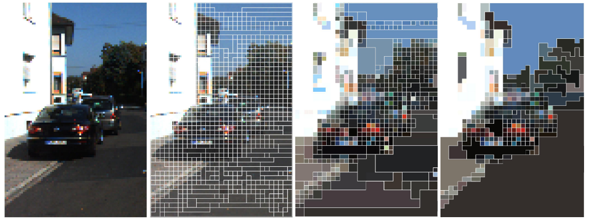
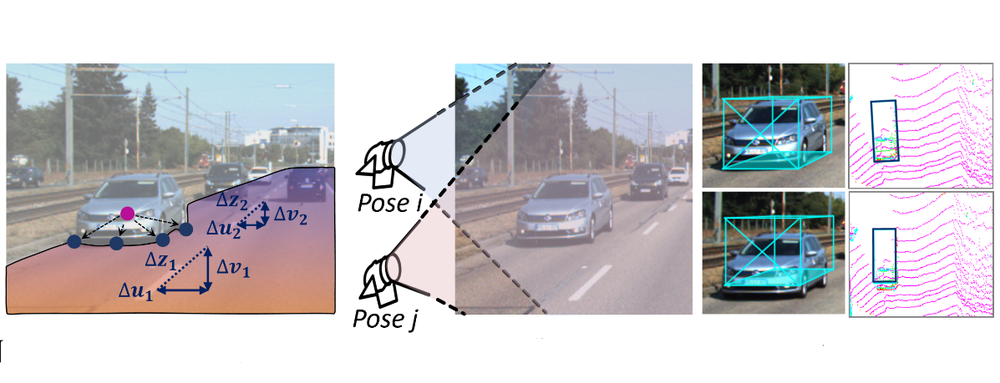
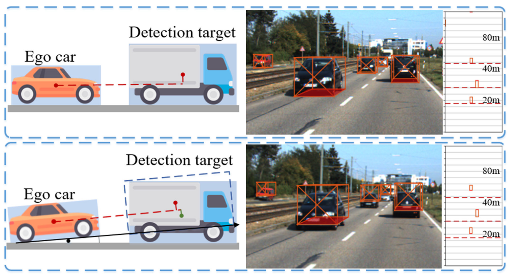
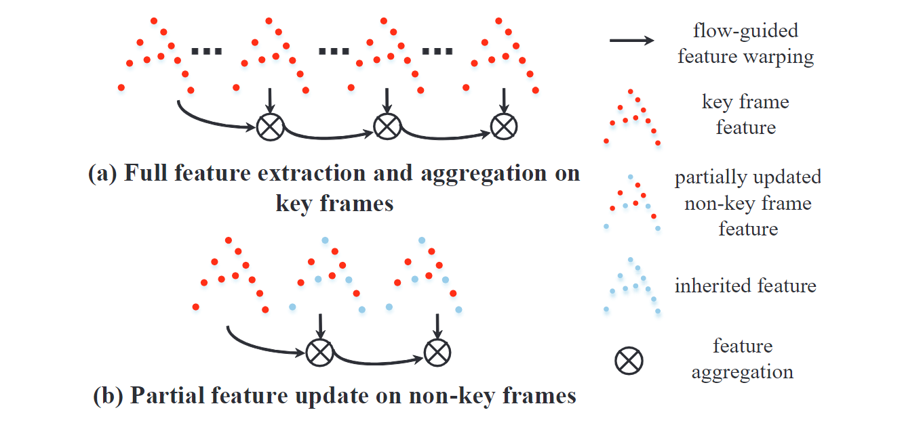
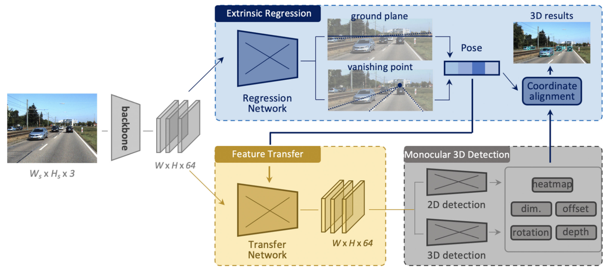








  

  

> A glimpse of Hermosa Beach, Los Angeles, California, where [La La Land](https://en.wikipedia.org/wiki/La_La_Land) was filmed.

Hi, I am a Ph.D. student from Wenjun Wu AI Hornour Class, Shanghai Jiao Tong University, majoring in Computer Science. Currently, I am supervised by Prof. [Hongzi Zhu](https://lion.sjtu.edu.cn/member/memberDetail?id=12) and [Minyi Guo](https://cs.sjtu.edu.cn/~guo-my/).
<!---
Meanwhile, I work as a discoverist at [**OpenDriveLab**](https://opendrivelab.com), supervised by Prof. [Hongyang Li](https://lihongyang.info). 
--->

My research interest includes ***robotics(perception, autonomous driving), embodied AI, and computer vision***. 

# 🔥 News
- *2024.12*: &nbsp;🔥 [**SimGen**](https://metadriverse.github.io/simgen) released 
- *2024.06*: &nbsp;💻 Host the CVPR2024 workshop on [**Autonomous Grand Challenge**](https://opendrivelab.com/challenge2024/)
- *2024.03*: &nbsp;🔥 [**ELM**](https://github.com/OpenDriveLab/ELM) released 
- *2024.01*: &nbsp;🎉 Become a visiting scholar at the University of California, Los Angeles, go bruins!
- *2023.08*: &nbsp;🔥 [**OpenScene**](https://github.com/OpenDriveLab/OpenScene) released 
- *2023.06*: &nbsp;💻 Host the CVPR2023 workshop on [**E2EAD**](https://opendrivelab.com/e2ead/cvpr23.html)
- *2022.12*: &nbsp;🎉 Become a member of [**OpenDriveLab**](https://opendrivelab.com)
- *2022.09*: &nbsp;🎉 Enrolled in Wenjun Wu AI Hornour Class

# 💻 Research

### `MetaDriverse | University of California, LA` 

*2024.01 - 2024.07*, **Video Diffusion Models and Driving Simulators**. Supervisor: [Bolei Zhou](https://boleizhou.github.io/).

<!---
### `OpenDriveLab | Shanghai AI Lab`

*2022.12 - (present)*, **End-to-end Autonomous Driving** and **Driving with Language**. Supervisor: [Hongyang Li](https://lihongyang.info).
--->

### `LION | Shanghai Jiao Tong University`

*2020.09 - (present)*, **Perception in Autonomous Driving**. Supervisor: [Hongzi Zhu](https://lion.sjtu.edu.cn/member/memberDetail?id=12) and [Minyi Guo](https://cs.sjtu.edu.cn/~guo-my/).

<!---
### Mobile Agent Perception@SenseTime

*2020.03 - 2020.12*, Supervisor: Prof. [Hongyang Li](https://lihongyang.info), Prof Jianping Shi.

- **Monocular 3D Vision** 
--->

# 📝 Publications 

## 🔥Highlighted Papers

Arxiv

Decoupled Diffusion Sparks Adaptive Scene Generation \\
**Yunsong Zhou**, Naisheng Ye, William Ljungbergh, Tianyu Li, Jiazhi Yang, Zetong Yang, Hongzi Zhu, Christoffer Petersson, Hongyang Li \\

NeurIPS 2024

SimGen: Simulator-conditioned Driving Scene Generation \\
**Yunsong Zhou**, Michael Simon, Zhenghao Peng, Sicheng Mo, Hongzi Zhu, Minyi Guo, and Bolei Zhou \\

ECCV 2024

Embodied Understanding of Driving Scenarios \\
**Yunsong Zhou**, Linyan Huang, Qingwen Bu, Jia Zeng, Tianyu Li, Hang Qiu, Hongzi Zhu, Minyi Guo, Yu Qiao, and Hongyang Li \\

## Perception in Autonomous Driving

TPAMI 2025

Exploiting Grounding Depth Estimation for Mobile Monocular 3D Object Detection \\
**Yunsong Zhou**, Quan Liu, Hongzi Zhu, Yunzhe Li, Shan Chang, and Minyi Guo \\

CVPR 2024

Extend Your Own Correspondences: Unsupervised Distant Point Cloud Registration by Progressive Distance Extension \\
Quan Liu, Hongzi Zhu, Zhenxi Wang, **Yunsong Zhou**, Shan Chang, and Minyi Guo \\

ICCV 2023

Density-invariant Features for Distant Point Cloud Registration \\
Quan Liu, Hongzi Zhu, **Yunsong Zhou**, Hongyang Li, Shan Chang, and Minyi Guo \\

IJCAI 2023

APR: Online Distant Point Cloud Registration Through Aggregated Point Cloud Reconstruction \\
Quan Liu, **Yunsong Zhou**, Hongzi Zhu, Shan Chang, and Minyi Guo \\

CVPR 2023

MonoATT: Online Monocular 3D Object Detection with Adaptive Token Transformer \\
**Yunsong Zhou**, Hongzi Zhu, Quan Liu, Shan Chang, and Minyi Guo \\

NeurIPS 2022

MoGDE: Boosting Mobile Monocular 3D Object Detection with Ground Depth Estimation \\
**Yunsong Zhou**, Quan Liu, Hongzi Zhu, Yunzhe Li, Shan Chang, and Minyi Guo. **Spotlight.** \\

TPAMI 2021

MonoEF: Extrinsic Parameter Free Monocular 3D Object Detection \\
**Yunsong Zhou**, Yuan He, Hongzi Zhu, Cheng Wang, Hongyang Li, and Qinhong Jiang \\

ICCV 2021

TempNet: Online Semantic Segmentation on Large-Scale Point Cloud Series \\
**Yunsong Zhou**, Hongzi Zhu, Chunqin Li, Tiankai Cui, Shan Chang, and Minyi Guo \\

CVPR 2021

Monocular 3D Object Detection: An Extrinsic Parameter Free Approach \\
**Yunsong Zhou**, Yuan He, Hongzi Zhu, Cheng Wang, Hongyang Li, and Qinhong Jiang \\

## Projects

CVPR Challenge

OpenScene: The large-scale dataset used for the End-to-End Driving and Predictive World Model tracks for the CVPR 2024 Autonomous Grand Challenge. \\

<!-- # 📝 Publications 

CVPR 2016

[Deep Residual Learning for Image Recognition](https://openaccess.thecvf.com/content_cvpr_2016/papers/He_Deep_Residual_Learning_CVPR_2016_paper.pdf)

**Kaiming He**, Xiangyu Zhang, Shaoqing Ren, Jian Sun

[**Project**](https://scholar.google.com/citations?view_op=view_citation&hl=zh-CN&user=DhtAFkwAAAAJ&citation_for_view=DhtAFkwAAAAJ:ALROH1vI_8AC) <strong></strong>
- Lorem ipsum dolor sit amet, consectetur adipiscing elit. Vivamus ornare aliquet ipsum, ac tempus justo dapibus sit amet. 

- [Lorem ipsum dolor sit amet, consectetur adipiscing elit. Vivamus ornare aliquet ipsum, ac tempus justo dapibus sit amet](https://github.com), A, B, C, **CVPR 2020** -->

# 📖 Educations
- *2020.09 - Present*, Ph.D., Computer Science, SEIEE, Shanghai Jiao Tong University.
- *2024.01 - 2024-07*, Visiting Scholar, University of California, Los Angeles.
- *2016.09 - 2020.06*, Bachelor, Microelectronic Science and Technology, SEIEE, Shanghai Jiao Tong University.

<!-- # 🎖 Honors and Awards
- *2021.10* Lorem ipsum dolor sit amet, consectetur adipiscing elit. Vivamus ornare aliquet ipsum, ac tempus justo dapibus sit amet. 
- *2021.09* Lorem ipsum dolor sit amet, consectetur adipiscing elit. Vivamus ornare aliquet ipsum, ac tempus justo dapibus sit amet.  -->

# 💬 Invited Talks
- *2024.07* Invited by **SONY** to give a talk on `Generative Models in Autonomous Driving`
- *2023.08* Invited by [**Motional**](https://motional.com/) to give a talk on `End-to-end Autonomous Driving`
