






  

  

> A glimpse of Hermosa Beach, Los Angeles, California, where [La La Land](https://en.wikipedia.org/wiki/La_La_Land) was filmed.

Hi, I am a Research Scientist at the Shanghai Artificial Intelligence Laboratory, leading research on **dexterous manipulation and generative models**, advised by Prof. [Weinan Zhang](https://wnzhang.net/) and Prof. [Chunhua Shen](https://cshen.github.io/).

I received my Ph.D. in Computer Science from Shanghai Jiao Tong University in 2025, supervised by Prof. [Minyi Guo](https://cs.sjtu.edu.cn/~guo-my/) and Prof. [Hongzi Zhu](https://lion.sjtu.edu.cn/member/memberDetail?id=12).
Besides, I was a student in the Wu WenjunAI Honours Class (吴文俊班), advised by Prof. [Cewu Lu](https://www.mvig.org/).
I have also gained international and industrial research experience. I conducted research at UCLA under the supervision of Prof. [Bolei Zhou](https://boleizhou.github.io/), and previously worked as a research intern at OpenDriveLab, advised by Prof. [Hongyang Li](https://lihongyang.info), where I was involved in autonomous driving–related research.

My research interests include ***Robotics (Dextrous Manipulation), Gen AI, and Embodied AI***. 

# 🔥 News
- *2026.04*: &nbsp;🔥 [**SIM1**](https://github.com/InternRobotics/SIM1) released 
- *2026.01*: &nbsp;🔥 [**InterVLA-A1**](https://github.com/InternRobotics/InternVLA-A1) released 
- *2024.12*: &nbsp;🔥 [**SimGen**](https://metadriverse.github.io/simgen) released 
- *2024.06*: &nbsp;💻 Host the CVPR2024 workshop on [**Autonomous Grand Challenge**](https://opendrivelab.com/challenge2024/)
- *2024.03*: &nbsp;🔥 [**ELM**](https://github.com/OpenDriveLab/ELM) released 
- *2024.01*: &nbsp;🎉 Become a visiting scholar at the University of California, Los Angeles, go bruins!
- *2023.06*: &nbsp;💻 Host the CVPR2023 workshop on [**E2EAD**](https://opendrivelab.com/e2ead/cvpr23.html)

<!---
### Mobile Agent Perception@SenseTime

*2020.03 - 2020.12*, Supervisor: Prof. [Hongyang Li](https://lihongyang.info), Prof Jianping Shi.

- **Monocular 3D Vision** 
--->

# 📝 Publications 

## 🔥Highlighted Papers

Arxiv

SIM1: Physics-Aligned Simulator as Zero-Shot Data Scaler in Deformable Worlds \\
**Yunsong Zhou†**, Hangxu Liu, Xuekun Jiang, Xing Shen, Yuanzhen Zhou, Hui Wang, Baole Fang, Yang Tian, Mulin Yu, Qiaojun Yu, Li Ma, Hengjie Li, Hanqing Wang, Jia Zeng, Jiangmiao Pang† \\

CVPR 2026

ForceVLA2: Unleashing Hybrid Force-Position Control with Force Awareness for Contact-Rich Manipulation \\
Yang Li, Hongru Jiang, Junjie Xia, Hongquan Zhang, Jinda Du, **Yunsong Zhou†**, Jia Zeng†, Ce Hao, Jieji Ren, Qiaojun Yu†, Cewu Lu†, Yu Qiao, Jiangmiao Pang \\

Arxiv
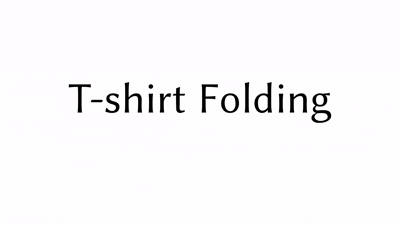

SoMA: A Real-to-Sim Neural Simulator for Robotic Soft-body Manipulation \\
Mu Huang, Hui Wang, Kerui Ren, Linning Xu, **Yunsong Zhou**, Mulin Yu, Bo Dai, Jiangmiao Pang \\

Tech Report
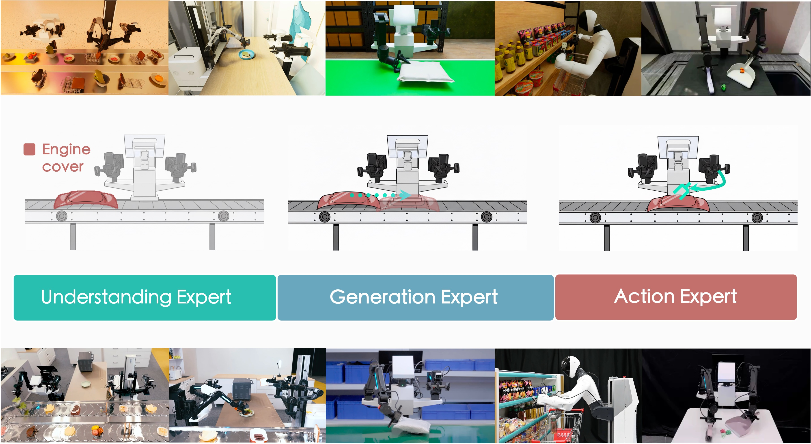

InternVLA-A1: Unifying Understanding, Generation and Action for Robotic Manipulation \\
Junhao Cai, Zetao Cai, Jiafei Cao, Yilun Chen, Zeyu He, Lei Jiang, Hang Li, Hengjie Li, Yang Li, Yufei Liu, Yanan Lu, Qi Lv, Haoxiang Ma, Jiangmiao Pang, Yu Qiao, Zherui Qiu, Yanqing Shen, Xu Shi, Yang Tian, Bolun Wang, Hanqing Wang, Jiaheng Wang, Tai Wang, Xueyuan Wei, Chao Wu, Yiman Xie, Boyang Xing, Yuqiang Yang, Yuyin Yang, Qiaojun Yu, Feng Yuan, Jia Zeng, Jingjing Zhang, Shenghan Zhang, Shi Zhang, Zhuoma Zhaxi, Bowen Zhou, Yuanzhen Zhou, **Yunsong Zhou**, Hongrui Zhu, Yangkun Zhu, Yuchen Zhu \\

## Mobile Vision

ICCV 2025

Decoupled Diffusion Sparks Adaptive Scene Generation \\
**Yunsong Zhou**, Naisheng Ye, William Ljungbergh, Tianyu Li, Jiazhi Yang, Zetong Yang, Hongzi Zhu, Christoffer Petersson, Hongyang Li \\

NeurIPS 2024

SimGen: Simulator-conditioned Driving Scene Generation \\
**Yunsong Zhou**, Michael Simon, Zhenghao Peng, Sicheng Mo, Hongzi Zhu, Minyi Guo, and Bolei Zhou \\

ECCV 2024

Embodied Understanding of Driving Scenarios \\
**Yunsong Zhou**, Linyan Huang, Qingwen Bu, Jia Zeng, Tianyu Li, Hang Qiu, Hongzi Zhu, Minyi Guo, Yu Qiao, and Hongyang Li \\

TPAMI 2025
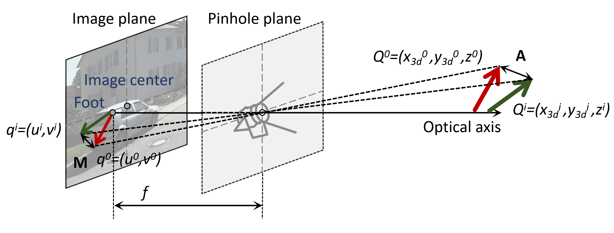

Exploiting Grounding Depth Estimation for Mobile Monocular 3D Object Detection \\
**Yunsong Zhou**, Quan Liu, Hongzi Zhu, Yunzhe Li, Shan Chang, and Minyi Guo \\

CVPR 2024
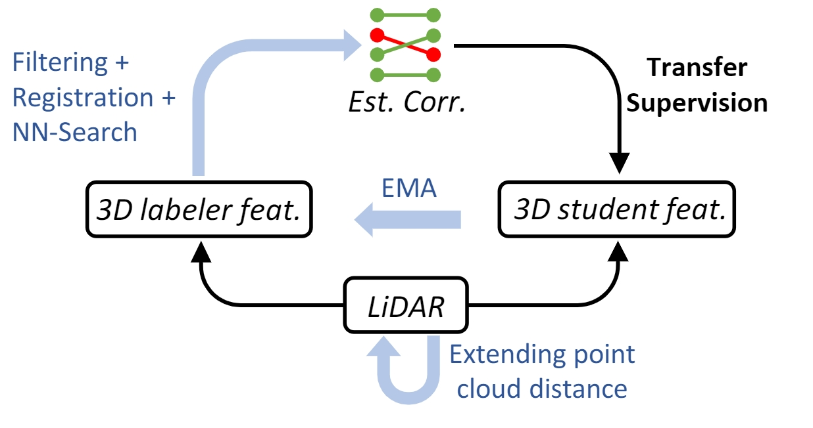

Extend Your Own Correspondences: Unsupervised Distant Point Cloud Registration by Progressive Distance Extension \\
Quan Liu, Hongzi Zhu, Zhenxi Wang, **Yunsong Zhou**, Shan Chang, and Minyi Guo \\

ICCV 2023
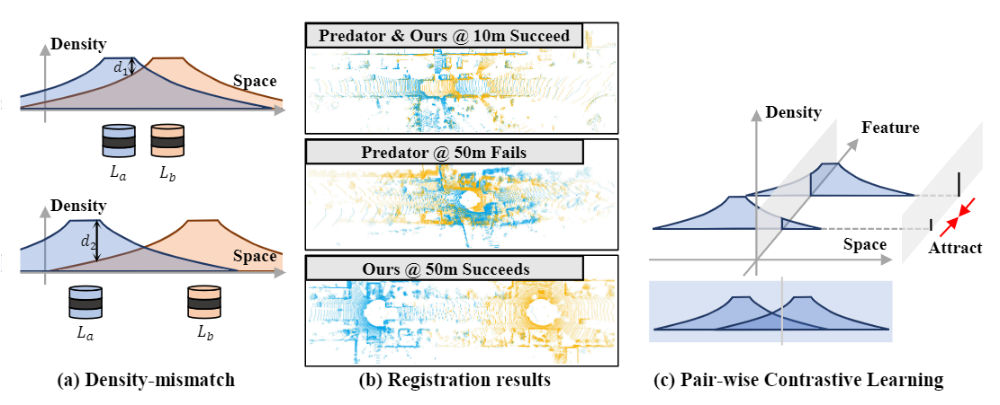

Density-invariant Features for Distant Point Cloud Registration \\
Quan Liu, Hongzi Zhu, **Yunsong Zhou**, Hongyang Li, Shan Chang, and Minyi Guo \\

IJCAI 2023
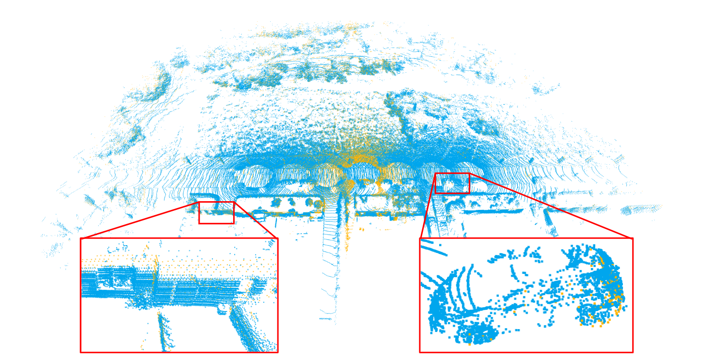

APR: Online Distant Point Cloud Registration Through Aggregated Point Cloud Reconstruction \\
Quan Liu, **Yunsong Zhou**, Hongzi Zhu, Shan Chang, and Minyi Guo \\

CVPR 2023
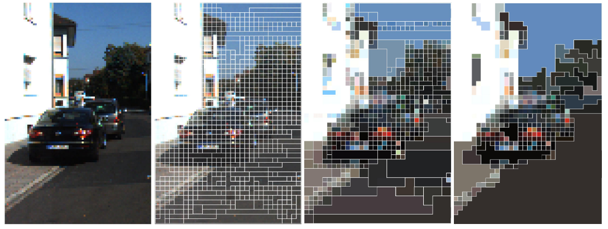

MonoATT: Online Monocular 3D Object Detection with Adaptive Token Transformer \\
**Yunsong Zhou**, Hongzi Zhu, Quan Liu, Shan Chang, and Minyi Guo \\

NeurIPS 2022
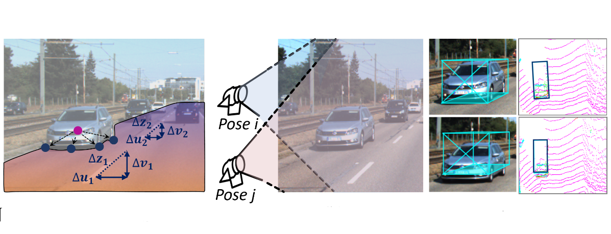

MoGDE: Boosting Mobile Monocular 3D Object Detection with Ground Depth Estimation \\
**Yunsong Zhou**, Quan Liu, Hongzi Zhu, Yunzhe Li, Shan Chang, and Minyi Guo. **Spotlight.** \\

TPAMI 2021
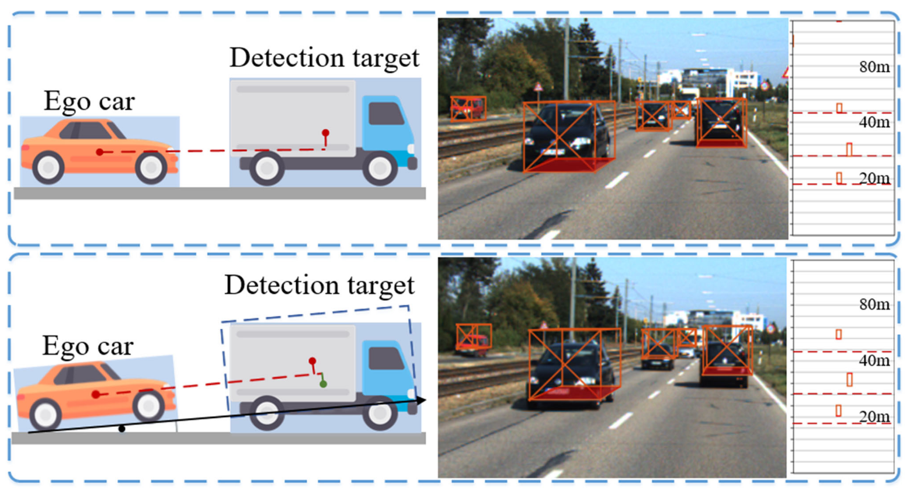

MonoEF: Extrinsic Parameter Free Monocular 3D Object Detection \\
**Yunsong Zhou**, Yuan He, Hongzi Zhu, Cheng Wang, Hongyang Li, and Qinhong Jiang \\

ICCV 2021
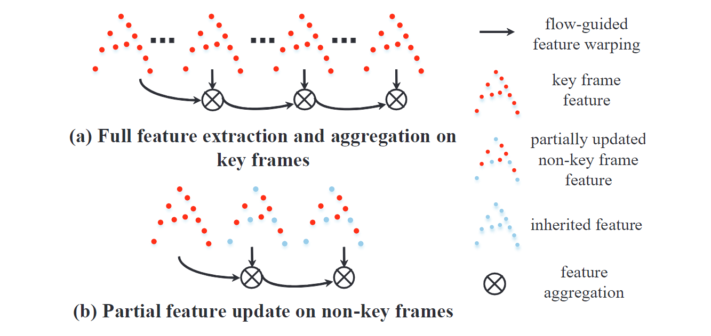

TempNet: Online Semantic Segmentation on Large-Scale Point Cloud Series \\
**Yunsong Zhou**, Hongzi Zhu, Chunqin Li, Tiankai Cui, Shan Chang, and Minyi Guo \\

CVPR 2021
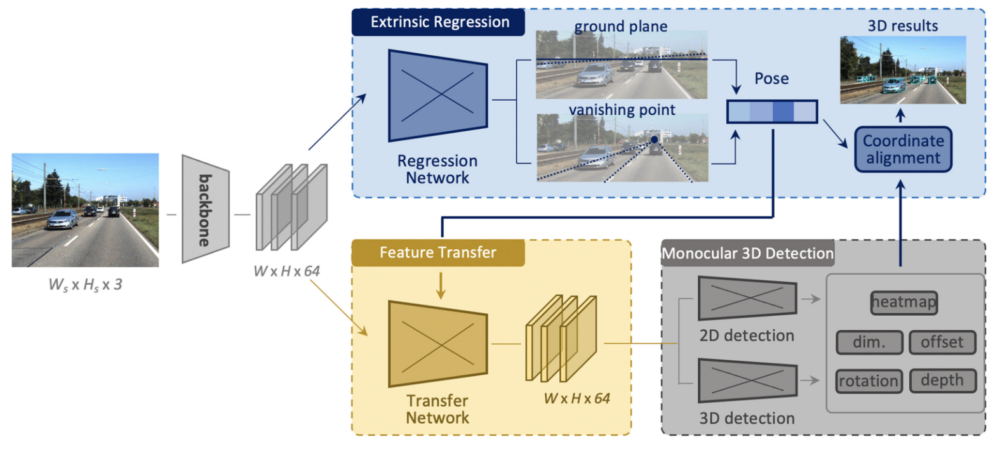

Monocular 3D Object Detection: An Extrinsic Parameter Free Approach \\
**Yunsong Zhou**, Yuan He, Hongzi Zhu, Cheng Wang, Hongyang Li, and Qinhong Jiang \\

## Projects

CVPR Challenge

OpenScene: The large-scale dataset used for the End-to-End Driving and Predictive World Model tracks for the CVPR 2024 Autonomous Grand Challenge. \\

<!-- # 📝 Publications 

CVPR 2016

[Deep Residual Learning for Image Recognition](https://openaccess.thecvf.com/content_cvpr_2016/papers/He_Deep_Residual_Learning_CVPR_2016_paper.pdf)

**Kaiming He**, Xiangyu Zhang, Shaoqing Ren, Jian Sun

[**Project**](https://scholar.google.com/citations?view_op=view_citation&hl=zh-CN&user=DhtAFkwAAAAJ&citation_for_view=DhtAFkwAAAAJ:ALROH1vI_8AC) <strong></strong>
- Lorem ipsum dolor sit amet, consectetur adipiscing elit. Vivamus ornare aliquet ipsum, ac tempus justo dapibus sit amet. 

- [Lorem ipsum dolor sit amet, consectetur adipiscing elit. Vivamus ornare aliquet ipsum, ac tempus justo dapibus sit amet](https://github.com), A, B, C, **CVPR 2020** -->

# 📖 Educations
- *2020.09 - 2025.09*, Ph.D., Computer Science, SEIEE, Shanghai Jiao Tong University.
- *2024.01 - 2024.07*, Visiting Scholar, University of California, Los Angeles.
- *2016.09 - 2020.06*, Bachelor, Microelectronic Science and Technology, SEIEE, Shanghai Jiao Tong University.

# 💻 Research

### `InternRobotics | Shanghai AI Laboratory`

*2025.09 - (present)*, **Dexterous Manipulation for Embodied AI**. Supervisor: [Jiangmiao Pang](https://oceanpang.github.io/).

### `MetaDriverse | University of California, LA` 

*2024.01 - 2024.07*, **Video Diffusion Models and Driving Simulators**. Supervisor: [Bolei Zhou](https://boleizhou.github.io/).

### `OpenDriveLab | Shanghai AI Lab`

*2022.12 - 2025.06*, **End-to-end Autonomous Driving** and **Driving with Language**. Supervisor: [Hongyang Li](https://lihongyang.info).

### `LION | Shanghai Jiao Tong University`

*2020.09 - 2025.06*, **Perception in Autonomous Driving**. Supervisor: [Hongzi Zhu](https://lion.sjtu.edu.cn/member/memberDetail?id=12) and [Minyi Guo](https://cs.sjtu.edu.cn/~guo-my/).

<!-- # 🎖 Honors and Awards
- *2021.10* Lorem ipsum dolor sit amet, consectetur adipiscing elit. Vivamus ornare aliquet ipsum, ac tempus justo dapibus sit amet. 
- *2021.09* Lorem ipsum dolor sit amet, consectetur adipiscing elit. Vivamus ornare aliquet ipsum, ac tempus justo dapibus sit amet.  -->

# 💬 Invited Talks
- *2024.07* Invited by **SONY** to give a talk on `Generative Models in Autonomous Driving`
- *2023.08* Invited by [**Motional**](https://motional.com/) to give a talk on `End-to-end Autonomous Driving`

Updated on April 27, 2026

